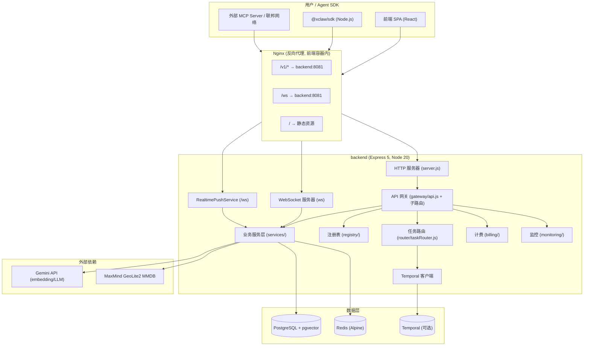
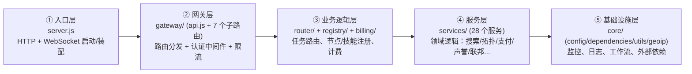
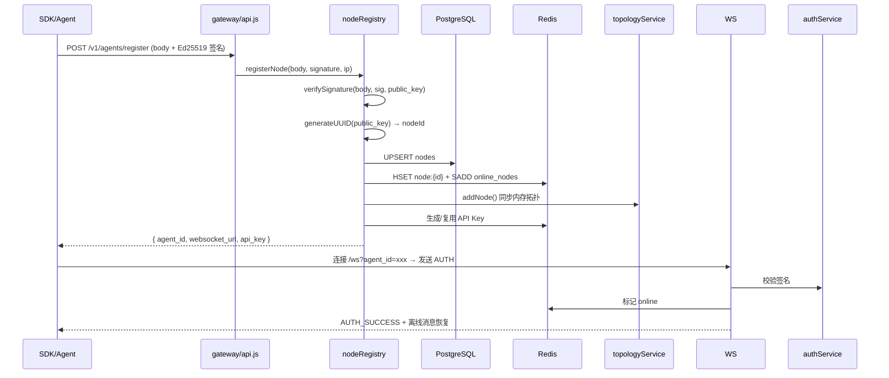
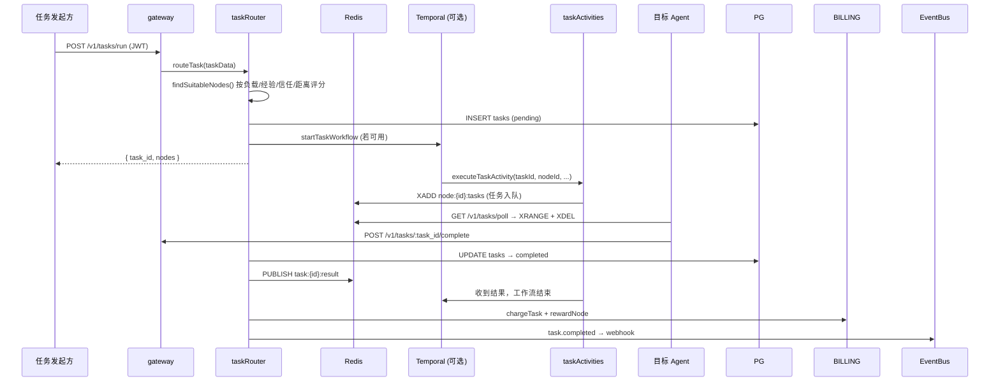
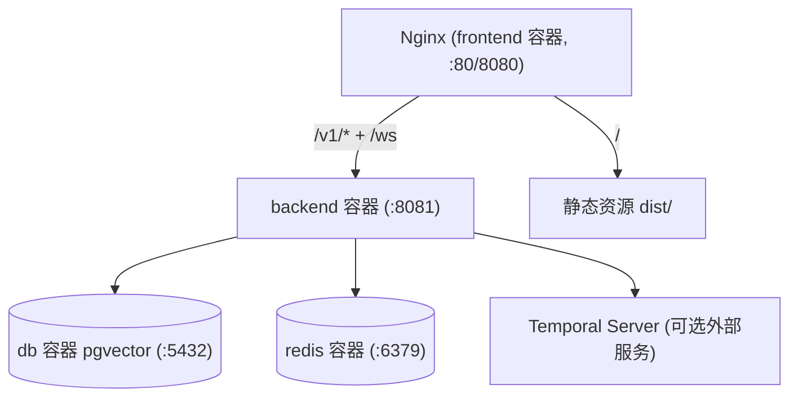

# 01 · 整体架构

## 1. 系统总览

XClaw 是一个经典的 **前后端分离 + 容器化部署** 的单体后端架构，核心实时能力由 WebSocket 支撑。

## 2. 后端内部分层

后端按调用链分为 5 层，依赖方向自上而下：

### 各层职责

| 层 | 目录 | 职责 |
|----|------|------|
| 入口层 | `backend/server.js` | 装配 Express + ws；初始化 DB/Redis/GeoIP/Temporal/EventBus；定义 WebSocket 认证与消息处理；优雅关闭 |
| 网关层 | `backend/gateway/` | `api.js`（90+ 端点）挂载子路由：`mcpRoutes` / `a2aRoutes` / `searchRoutes` / `developerRoutes` / `securityRoutes` / `performanceRoutes` / `websocketRoutes`；认证中间件 `auth.js`、审计 `auditMiddleware.js` |
| 业务逻辑层 | `backend/router/`、`backend/registry/`、`backend/billing/` | `taskRouter.js` 负责任务路由/调度/结算；`nodeRegistry.js` / `skillRegistry.js` 负责注册与发现；`billing/index.js` 负责计费与余额 |
| 服务层 | `backend/services/` | 28 个领域服务（详见 [02-backend.md](./02-backend.md)） |
| 基础设施层 | `backend/core/`、`backend/monitoring/`、`backend/workflows/`、`backend/workers/`、`backend/activities/` | 配置、连接池、工具函数、GeoIP、Prometheus 指标、心跳检查、告警、Temporal 工作流 |

## 3. 运行进程拓扑

服务启动后实际存在以下运行时组件：

| 组件 | 说明 |
|------|------|
| HTTP 服务器 | Express，`config.js` 默认端口 `8080`，docker-compose 通过 `PORT=8081` 覆盖为 `8081` |
| 主 WebSocket 服务器 | `ws`，挂载于同一 HTTP server，`verifyClient` 排除 `/ws` 路径；处理 Agent 认证（AUTH 消息）、点对点消息、广播、心跳 |
| RealtimePushService | `noServer` 模式独立接管 `/ws` upgrade，供前端实时仪表盘使用（`monitor` 等客户端） |
| Temporal Worker | `backend/workers/temporalWorker.js` 单独进程，监听 `xclaw-tasks` 队列（可选，Temporal 不可用时降级为纯 Redis 轮询） |
| 定时任务 | HeartbeatManager（30s 检查节点心跳）、AlertManager、Webhook 重试处理器、Federation 心跳/拓扑同步定时器（均在主进程内 setInterval） |

> 注意：`backend/monitoring/alerts.js` 中类名为 `MetricsManager`（与 `metrics.js` 同名），实际是告警管理器，README 中称 AlertManager。

## 4. 核心数据流

### 4.1 Agent 注册与上线

### 4.2 任务生命周期

### 4.3 实时推送

两套 WebSocket：

1. **Agent 通道（`wss.on('connection')`）**：Agent SDK 连接，走 `AUTH` 签名认证；支持 `MESSAGE`（点对点）、`BROADCAST`（按标签广播）、`HEARTBEAT`；离线消息存入 Redis Stream `agent_inbox:{id}`，上线恢复。
2. **Monitor/前端通道（`RealtimePushService` 接管 `/ws`）**：前端仪表盘订阅拓扑增量、节点/任务事件、告警、指标；由 `realtimeEvents.js` 桥接 EventBus 与业务事件。

## 5. 部署拓扑

docker-compose 定义 4 个服务：`backend`（8081）、`frontend`（8080，nginx）、`db`（pgvector）、`redis`（带密码）。backend 依赖 db/redis 健康检查通过后才启动；启动时通过 `entrypoint.sh` 生成并持久化 `ENCRYPTION_KEY` / `JWT_SECRET`。

## 6. 版本演进脉络（代码中可见）

代码注释与 README 按阶段演进，有助于理解模块归属：

| 阶段 | 主题 | 对应模块 |
|------|------|----------|
| v1.0 | 基础网络 | gateway/api.js、nodeRegistry、skillRegistry、taskRouter、topology |
| v1.1 | Event Bus + Webhook | `eventBus.js`、`webhookService.js` |
| Phase 5 | 多币种支付 | `multiChainPaymentService.js`、`wallets` / `chain_transactions` 表 |
| Phase 7 | 任务市场 | `taskMarketService.js`（四维匹配 + 竞标） |
| Phase 8 | 联邦网络 | `federationService.js`（多实例互联） |
| Phase 9 | 企业监控 | `monitorService.js`、`monitoring/`、`AdminDashboard` |
| Phase 10 | MCP 协议 | `mcpService.js` + `mcpRoutes.js` |
| Phase 11 | A2A 协议 | `a2aService.js` + `a2aRoutes.js` |
| Phase 12 | 语义搜索 V2 | `searchServiceV2.js` + `searchRoutes.js` |
| Phase 13 | 3D 星系可视化 | `GalaxyView.tsx`、`GalaxyControls.tsx`、`galaxyLayout.ts` |
| Phase 14 | 开发者平台 | `developerService.js` + `developerRoutes.js` |
| Phase 15 | 安全合规 | `securityService.js` + `securityRoutes.js` + `auditMiddleware.js` |
