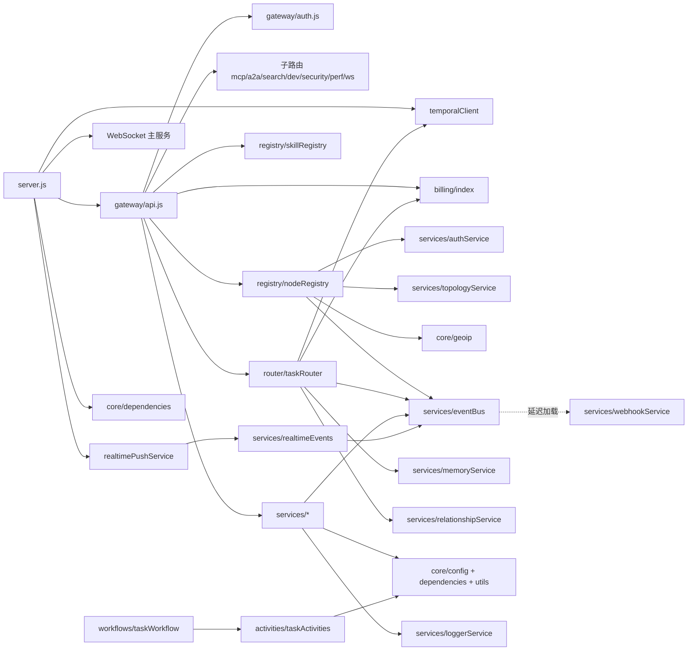

# 07 · 依赖关系

## 1. 内部模块依赖图（后端）



依赖要点：

- **循环依赖处理**：`eventBus` 通过 `await import()` 延迟加载 `webhookService`；`api.js` 中 `searchEngine` 也用动态 import 作为兜底
- **单例注入**：几乎全部服务通过 `getPostgres()` / `getRedis()`（`core/dependencies.js`）获取数据层连接，而非构造函数注入
- **服务间协作**：`taskRouter` 依赖 billing/memory/relationship/eventBus；`nodeRegistry` 依赖 authService/topologyService/geoip/eventBus

## 2. 外部 npm 依赖

### backend/package.json

| 类别 | 依赖 | 用途 |
|------|------|------|
| HTTP | `express@5`、`cors`、`helmet`、`hpp` | Web 框架与安全头 |
| 限流 | `express-rate-limit` | 全局限流 + 技能级限流 |
| 校验 | `express-validator` | 参数校验 |
| WebSocket | `ws` | 实时通信 |
| 数据库 | `pg`、`ioredis` | PostgreSQL / Redis 客户端 |
| 工作流 | `@temporalio/*`（client/worker/workflow/activity） | 任务编排 |
| AI | `axios` | LLM/embedding HTTP 调用 |
| 安全 | `jsonwebtoken`、`maxmind` | JWT（备用）、GeoIP |
| 弹性 | `opossum` | 熔断器（AI 调用） |
| 可观测 | `prom-client`、`winston`、`winston-daily-rotate-file` | 指标、日志、轮转 |
| 工具 | `dotenv`、`uuid` | 配置与 UUID |
| 测试 | `jest` | 单元/集成测试 |

### frontend/package.json

React 19、react-dom、react-router-dom 7、zustand 5、tailwindcss 3.4、framer-motion、deck.gl 全家桶（`@deck.gl/core/layers/geo-layers/react`）、d3、d3-force-3d、three + @react-three/fiber + drei、maplibre-gl + react-map-gl、vite 8、typescript 5.9、eslint 9。

### sdk/package.json

仅 `ws`；引擎要求 Node >= 18。

## 3. 外部运行时服务

| 服务 | 用途 | 必需？ |
|------|------|--------|
| PostgreSQL + pgvector | 主存储 | 是 |
| Redis | 缓存、在线状态、任务队列、离线消息 | 是 |
| Temporal | 任务工作流引擎 | 否（自动降级为 Redis 轮询） |
| Gemini API（embedding + LLM） | 语义搜索、Agent 解析 | 建议（无 key 时搜索降级为关键词匹配） |
| LongCat LLM API | 文本生成（`AI_BASE_URL`） | 可选 |
| MaxMind GeoLite2 MMDB | IP 地理定位 | 可选（缺失时坐标默认 0,0） |

## 4. 环境变量清单（.env.example）

| 变量 | 默认值 | 说明 |
|------|--------|------|
| `NODE_ENV` | `production` | 运行环境 |
| `PORT` | `8081` | 后端端口 |
| `HOST` | `0.0.0.0` | 监听地址 |
| `DATABASE_URL` | - | PG 连接串（docker 内 `postgres://postgres:***@db:5432/xclaw`） |
| `DB_HOST/DB_PORT/DB_NAME/DB_USER/DB_PASSWORD` | - | 分项配置（无 DATABASE_URL 时使用） |
| `REDIS_HOST/REDIS_PORT/REDIS_PASSWORD` | - | Redis 配置 |
| `API_KEY` | - | 系统级 API Key（`xclw_` + 48 hex） |
| `ADMIN_API_KEY` | 同 API_KEY | 管理员 Key |
| `JWT_SECRET` | 必填 | JWT 签名密钥（entrypoint 自动生成持久化） |
| `ENCRYPTION_KEY` | 必填 | AES 加密密钥（entrypoint 自动生成持久化） |
| `AI_API_KEY` / `AI_BASE_URL` / `AI_MODEL` | Gemini 兼容端点 | LLM 配置 |
| `AI_EMBEDDING_MODEL` / `AI_EMBEDDING_BASE_URL` / `AI_EMBEDDING_API_KEY` | `gemini-embedding-001` | 向量模型配置 |
| `PUBLIC_URL` / `WS_PUBLIC_URL` | `https://xclaw.network` | 对外地址（生成注册返回的 ws URL） |
| `NETWORK_ID` | `default` | 联邦网络标识 |
| `LOCAL_ENDPOINT` | `http://backend:8081` | 联邦对等端点 |
| `MONITOR_TOKEN` | - | monitor WS 连接 token |
| `TASK_BASE_PRICE` / `MAX_TASKS_PER_NODE` / `TASK_TIMEOUT_MS` / `TASK_MAX_RETRIES` | 0.01 / 10 / 300000 / 2 | 任务调度参数 |
| `WS_RATE_LIMIT` / `WS_RATE_WINDOW_MS` | 30 / 10000 | WS 消息限流 |
| `CORS_ORIGINS` | xclaw.network 等 | CORS 白名单（逗号分隔） |
| `GEOIP_DB_PATH` | - | MMDB 路径 |
| `LOG_LEVEL` / `LOG_DIR` | info / ./logs | 日志 |
| `MAXMIND_LICENSE_KEY` | - | GeoLite2 下载 |

前端环境变量（`VITE_` 前缀）：

| 变量 | 默认 | 说明 |
|------|------|------|
| `VITE_API_URL` | 同源 | REST API 基地址 |
| `VITE_WS_URL` | 同源派生 | WebSocket 地址 |

## 5. 端口与服务映射（docker-compose）

| 服务 | 容器名 | 端口 | 健康检查 |
|------|--------|------|----------|
| backend | xclaw-backend | `8081` | `curl /health`，30s 间隔 |
| frontend | xclaw-frontend | `8080 → 80` | - |
| db | xclaw-db | `5432` | `pg_isready` |
| redis | xclaw-redis | `6379` | `redis-cli ping`（带密码） |

backend 容器限制 512M 内存，挂载 `GeoLite2-City.mmdb` 只读卷；db 挂载 `database/schema.sql` 到 `docker-entrypoint-initdb.d`（首次初始化）。

## 6. 认证体系依赖

```text
Level 1: API Key（Authorization: <API_KEY>）          → gateway/auth.js verifyApiKey
Level 2: JWT（Authorization: Bearer <token>）          → authService.authMiddleware
Level 3: Ed25519 签名（x-agent-signature / AUTH 消息） → core/utils.verifySignature + authService
```

认证链路依赖 Redis（API Key 映射、JWT 黑名单）与 PG（public_key 回源）。

